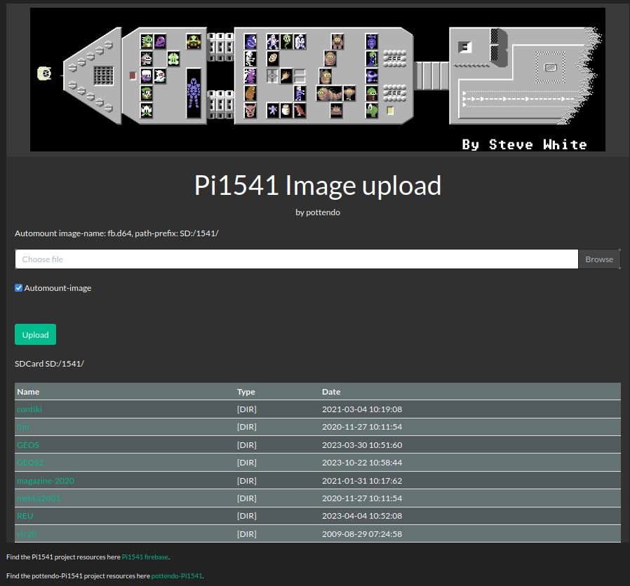
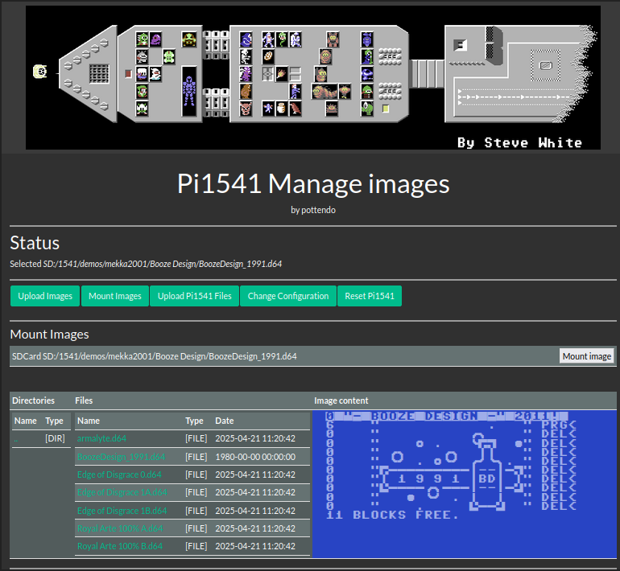
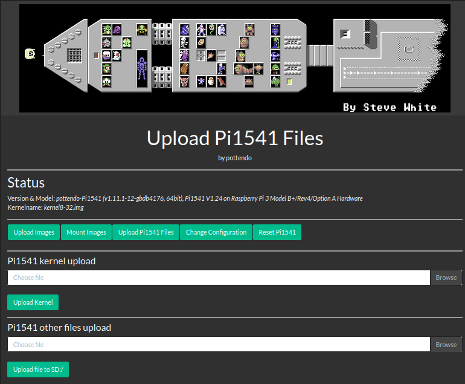
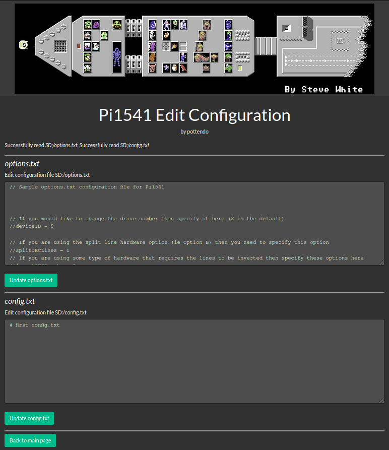

# Pi1541 - Circle ported, ready for new features

This is an optional port of Pi1541 (V1.24) to the current Circle bare metal library (as of March 2025, Version 49.0).

As almost all Pi model specific bindings which have a counterparts in Circle have been removed. This allows to use the potential of Circle to extend Pi1541 with new functionalities. 
A simple web-server features
- upload of images to the SDCard
- upload of a Pi1541 kernel image
- upload of Pi1541 files like _options.txt_, _config.txt_
- edit of _options.txt_ and _config.txt_
- mount images, including an image content preview (d81 preview not supported)
- reboot of Pi1541

Some further ideas:
- Enhance webserver to support image administration (copy, move, delete, rename, etc.)
- Make some options changeable via a WebGUI controls: e.g. drive number, etc.
- _.lst_ file handling
- ...

Credits to Steve (@pi1541) [Pi1541](https://cbm-pi1541.firebaseapp.com/) and [Pi1541-github](https://github.com/pi1541/Pi1541), Rene (@rsta2) [circle](https://github.com/rsta2/circle), Stephan (@smuehlst) [circle-stdlib](https://github.com/smuehlst/circle-stdlib) for the brilliant base packages! Also some credit goes to @hpingel, [Network SK64](sk64), where I got the inspiration how to implement the webserver.

Some discussions, announcements one can find in the Forum64 thread, [here](https://www.forum64.de/index.php?thread/155126-new-release-pottendo-pi1541-webserver-for-upload-images-updates/&postID=2276999#post2276999).

# Installation

For your convencience a fully populated Pi1541 is prepared for easy setup. 
Copy the content of the release bundle to your boot partition of your Pi1541 SDCard. Make sure you adapt `options.txt` to your Pi1541 hardware setup (_Option A_ or _Option B_). Option B hardware is default. If you want to use networking (Wifi or Ethernet), see below how to activate.

# Status
------
The following is supposed to work on the circle based _V1.24c_, as I've tested those functions a bit:
- Pi1541 on Raspberry models 3B+, PiZero 2W, 4: successful load (JiffyDOS) of some games with fastloaders and GEOS
- LCD Display SSD1306
- Rotary Input
- Option A HW Support 
- Option B HW Support *)
- Buzzer sound output
- PWM/DMA Soundoutput (sounds nicer than in legacy codebase, IMHO)
- USB Keyboard and USB Massstorage (improved over original, see also Bugs below)
- Ethernet or WiFi network (if configured) starts and seeks for a DHCP server, a webserver runs, time is fetched via NTP if possible

Credits to @znarF and @ILAH on F64, who kindly tested Option B HW.
<br />

*) _now validated with at least 2 setups_ - credits to @ILAH and @znarF on F64!

<br />

If enabled (see below), network is activated in the background. For Wifi it may take a few seconds to connect and retreive the IP Address via DHCP. One can chose a static network configuration for faster startup, see below.
The IP address is briefly shown on the LCD, once received. One can check the IP address on the screen (HDMI).

<br />

The webserver controls the main emulation loop (e.g. uploads finished) by global variables. Access to the SDCard Filesystem is not synchronized or otherwise protected. If an (C64-) application writes to its disk, respectivley to the disk-image on Pi1541 and in parallel the webserver is used to upload the very same image, file-corruption or even file-system corruption may occur. The server and parallel emulation seems quite independent. I've tested a critical fastloader(Ghost'n'Goblins Arcade) and uploading in parallel successfully.

One can also use `curl` to script the upload - this may be usefull to be included in your build-process or bulk upload into `/1541` or other directories. The commandlines to be used looks like this:
```
# replace a.b.c.d with you Pi1541 IP address
# this uploads to SD:/1541 on your SDCard
curl POST -F "diskimage=@/path/to/my-diskimage.d64" http://a.b.c.d/index.html >/dev/null
# this uploads to /1541/demos/deus
curl POST -F "diskimage=@/path/to/my-diskimage.d64" http://a.b.c.d/index.html?%5BDIR%5D\&demos/deus >/dev/null

# to mount an image which resides in SD:/1541
curl http://a.b.c.d/manage-imgs.html?%5BMOUNT%5D\&my-diskimage.d64 >/dev/null
# to mount an image which resides in SD:/1541/demos/deus
curl http://a.b.c.d/manage-imgs.html?%5BMOUNT%5D\&demos/deus/my-diskimage.d64 >/dev/null
```
_Note_: not all error cases of e.g. wrongly supplied paths could be handled, so curl may report success without the desired effect


<br />

Note: checking the <i>Automount-image</i> checkbox, uploads and overrides the default automount image automatically inserts it in the caddy. This allows an efficient development workflow, IMHO.


<br />

Select image for preview and mount it.
<br />


<br />

Updates of Pi1541 kernel images require the correct filename, which must match the Pi model and the line `kernel=...` in `config.txt`. Once the filename is correct, files are overridden on the SDCard, no backup is made!


<br />

A simple text-entry form based configuration editor is provided. Once uploaded potentially existing files on the SDCard are backuped by adding `.BAK` and then the content of the text-entry form is written to the file. Be careful, no sanity checks are made. Wrong configuration may stop Pi1541 from working after reboot.
<br />

The codebase is the publically available Pi1541 code, V1.24 (as of Jan. 2024) with some improvements:

- LED/Buzzer work again as in 1.23
- some bugfixes to avoid crash (missing initializer)
- build support for moden GCCs (-mno-unaligend-access)
- new option `headLess`, see below
- new options for static or DHCP network configuration, see below
- as a reset button is missing on most PIs, this is mapped to the button combo which selects DriveID 11 (a rare use-case for me)

Still the legacy code can be built with support for all supported hardware variants, include PiZero, Pi1 and Pi2 variants - see build chapter _Build_.
The floppy emulation is entirely untouched, so it's as good as it was/is in V1.24 - which is pretty good, IMHO! **Credits to Steve!**
<br />

## Misc
Other uController support has been added:
- Raspberry Pico 2 W (see directory _pico1541_)
- ESP32 (PSRAM) (see directory _esp1541_)

However, the code compiles and runs in principle on those platforms; due to the limits of those uControllers Pi1541 won't run. The code can be used as base for further more powerful uControllers providing sufficient memory and performance to handel Pi1541 hard realtime requirements.

**Attention**: the operating temperature is substantially higher than with the original kernel (legacy build). It is recommended to use _active_ cooling as of now. Raspeberry PIs normally protect themselves through throtteling. This should work latest at 85C - you may lower this threshold via `cmdline.txt` using e.g. `socmaxtemp=78`.

## TODOs

- You tell me!

## What will not come

- PiZero support for circle, as it doesn't make sense due to lack of network support
- Circle Support for all variants of Pi1 and Pi2, as I don't have those to test
- Pi5 support - with support from @rsta, I found that the GPIO performance of the Pi5 is significantly slower than on earlier models due to its changed hardware architecture. Even with some tweaking, Pi1541 misses cycles and emulation breaks. The code is prepared for Pi5, but as of now not working; maybe never will.
- Pico2/ESP32 support
  
# Additional Options in `options.txt`

The following options control new functions available:
| Option      | Value  | Purpose                                  |
| ----------- | ------ | ---------------------------------------- |
| TZ          | e.g. 2.0 | set the timezone relative to UTC, CEST = 2.0, NewYork/US = -5.0, Delhi/In = 5.5 |
| netEthernet | 0 or 1 | disable/enable Ethernet network          |
| netWifi     | 0 or 1 | disable/enable Wifi network              |
| IPAddress   | a.b.c.d | IP Address, e.g. _192.168.1.31_          |
| NetMask   | a.b.c.d | NetMask, e.g. _192.168.1.0_          |
| DefaultGateway   | a.b.c.d | Gatway Address, e.g. _192.168.1.1_          |
| DNSServer   | a.b.c.d | DNS Server, e.g. _192.168.1.1_          |
| headLess    | 0 or 1 | disable/enable headless (no HDMI output) |

Here a snippet one can add to his `options.txt`:
```
// this turns on/off HDMI output
headLess = 1  // no HDMI output

// Network configuration, WiFi needs a proper wpa_supplicant.conf configured for you SSID
TZ = 2.0    // Timezone: 2.0=CEST is default, use -5.0 for ET (e.g. New York/US), use 5.5 for New Delhi/IN
netWifi = 0
netEthernet = 1
// Static network config, to avoid slow DHCP - not much sanity is done, so write properly
useDHCP = 1 // get network config automatically, else uncomment and define static network config below
//IPAdress = 192.168.1.31
//NetMask = 192.168.1.0
//DefaultGateway = 192.168.1.1
//DNSServer = 192.168.1.1
```
# Know Bugs

- Pluging in a USB stick _after_ booting, won't show files on the USB mounted drive and display remains dark. Unplugging/re-plugging works as expected if USB is plugged in at startup
- Pi5 not yet working

# Checkout & Build

The following compiler suites were used for development:

| Compiler | Package name                                     | Link                                                                                                                                          | Arch               |
| -------- | ------------------------------------------------ | --------------------------------------------------------------------------------------------------------------------------------------------- | ------------------ |
| GCC      | AArch32 bare-metal target (arm-none-eabi)        | [download](https://developer.arm.com/-/media/Files/downloads/gnu/13.2.rel1/binrel/arm-gnu-toolchain-13.2.rel1-x86_64-arm-none-eabi.tar.xz)    | 32 bit             |
| GCC      | AArch64 ELF bare-metal target (aarch64-none-elf) | [download](https://developer.arm.com/-/media/Files/downloads/gnu/13.2.rel1/binrel/arm-gnu-toolchain-13.2.rel1-x86_64-aarch64-none-elf.tar.xz) | 64 bit |

Make sure your `PATH` variable is set appropriately to find the installed compiler suite.

For building the project needs certain developer tools installed. Depending on your Linux installation these may be needed to be installed:
_make, wget, unzip, git, sed, patch_.

My development machine is an x86_64 based ArchLinux box.
Checkout & build
```
BUILDDIR=build-pottendo-Pi1541
mkdir $BUILDDIR
cd ${BUILDDIR}
git clone https://github.com/pottendo/pottendo-Pi1541.git

# now checkout circle-stdlib and populate a Pi1541 root
cd ${BUILDDIR}/pottendo-Pi1541
./build.sh -c   # this clones circle-stdlib in ${BUILDDIR} and populates a Pi-bootpartition here: ${BUILDDIR}/Pi-Bootpart
# if all goes well, you're ready to build
./build.sh      # kernels for Pi3/32bit Pi3/64bit Pi4/32bit Pi4/64bit are built and finally moved to ${BUILDDIR}
# to build for a single architecture, one can use e.g. 'build.sh -a pi3-32' 
# subsequently you can build just using 'make' this uses circle-stdlib as used with the previous 'build.sh' run

```
Depending on the RPi Model and on the chosen build (Circle vs. legacy):
| Model                 | Version      | build cmd                                         | Image Name                                         | Note                                  |
| --------------------- | ------------ | ------------------------------------------------- | -------------------------------------------------- | ------------------------------------- |
| Pi Zero, 1RevXX, 2, 3 | legacy build | `make RASPPI={0,1BRev1,1BRev2,1BPlus,2,3} legacy` | `kernel.img`                                      |                                       |
| 3                     | circle build | `make`                                            | `kernel8-32.img` (32bit), `kernel8.img`(64bit)                                   |                                       |
| Pi Zero 2W            | circle build | `make`                                            | `kernel8-32.img`                                   | PWM Sound not upported                |
| Pi 4                  | circle build | `make`                                            | `kernel7l.img` (32bit), `kernel8-rpi4.img` (64bit) |                                       |
| Pi 5                  | circle build | `make`                                            | `kernel_2712.img`                                  | broken, PWM Sound not (yet) supported |

*Hint*: in case you want to alternatively build for circle-lib and legacy make sure to `make clean` between the builds!

Finally copy the kernel image(s) to your Pi1541 SDCard boot partition.
The prepared _config.txt_ covers several Pi models, and defaults to 64bit versions. If you want to boot the 32 bit versions, adjust `config.txt` accordingly - see comments below.
In case you want to run the slightly improved legacy 1.24 version (_kernel.img_) you may reuse the [pi0] section at the top for a Pi Zero.

Here the sample `config.txt` on your Pi1541 SDcard, ready to be used for pottendo-Pi1541:

```
[pi0]
arm_freq=1100
over_voltage=8
sdram_freq=500
sdram_over_voltage=2
force_turbo=1
boot_delay=1
arm_64bit=0
kernel_address=0x1f00000
kernel=kernel.img

# this is for the PiZero 2 W
[pi02]
arm_freq=1300
over_voltage=4
sdram_freq=500
sdram_over_voltage=1
force_turbo=1
boot_delay=1
gpu_mem=16
hdmi_group=2
hdmi_mode=16
# select 32- or 64-bit mode
arm_64bit=1
# Pi 3 & Pi Zero 2W, 32bit
#kernel=kernel8-32.img
# Pi 3 & Pi Zero 2W, 64bit
kernel=kernel8.img

# all Pi3 variants
[pi3]
arm_freq=1300
over_voltage=4
sdram_freq=500
sdram_over_voltage=1
force_turbo=1
boot_delay=1
gpu_mem=16
hdmi_group=2
hdmi_mode=16
# select 32- or 64-bit mode
arm_64bit=1
# Pi 3 & Pi Zero 2W, 32bit
#kernel=kernel8-32.img
# Pi 3 & Pi Zero 2W, 64bit
kernel=kernel8.img
# Pi3 legacy 32bit kernel
#kernel_address=0x1f00000
#kernel=kernel.img

# all Pi4 variants
[pi4]
hdmi_force_hotplug=1   # Force HDMI output even if no monitor detected
hdmi_group=2           # Set display mode to DMT (monitor)
hdmi_mode=82           # Set resolution to 1920x1080 @ 60Hz
max_framebuffers=2
# select 32- or 64-bit mode
arm_64bit=1
# Pi 4, 32bit
#kernel=kernel7l.img
# Pi 4, 64bit
kernel=kernel8-rpi4.img

[all]
enable_uart=1
# Disable compensation for displays with overscan
disable_overscan=1
```

Uart console on pins *14(TX)/15(RX)* gives useful log information. A sample _cmdline.txt_ with `console=serial0,115200 logdev=ttyS1 socmaxtemp=75 loglevel=2` is provided. If you have other options, put all options in one line, put _loglevel=4_ if you want to see the full developer debug log.

## Pi Bootfiles

All necessary files for Pi Zero/2, Pi3 and Pi4 and their variants are provided on the sample bootpartition.

## Networking

If enabled, WiFi needs the drivers on the flash card. All necessary files are provided on the sample bootpartition.

However you need edit the file 
  `wpa_supplicant.conf`
on the toplevel to configure your SSID:
```
#
# wpa_supplicant.conf
#
# adjust your country code
country=AT

network={
    # adjust your SSID
    ssid="REPLACE_WITH_MY_NETWORK_SSI"
    # adjust your WiFi password
    psk="REPLACYE_WITH_MY_WIFI_PASSWORD"
    proto=WPA2
    key_mgmt=WPA-PSK
}
```
## Building the original verision

One can build the Version 1.24 (+some minor fixes: LED & Buzzer work, build/works with gcc > 10.x).

```
# for Legacy build:
# use RASPPI = 1BRev1 for Raspberry Pi 1B Rev 1 (26 IOports) (GPIO0/1/21)
# use RASPPI = 1BRev2 for Raspberry Pi 1B Rev 2 (26 IOports) (GPIO2/3/27)
# use RASPPI = 1BPlus for Raspberry Pi 1B+ (40 I/OPorts)
# use RASPPI = 0 for Raspberry Pi Zero
# use RASPPI = 3 for Raspberry Pi Zero 2W or Raspberry Pi 3
# use V = 1 optionally for verbose build
# e.g.
# 	make RASPPI=1BPlus V=1 legacy
#
# if you switch from legacy build to circle build 'make clean' is mandatory
```

Copy the resulting `kernel.img` to your SDCard and adjust the appropriate section _[pi3]_ to load this image by uncommenting the lines
```
kernel_address=0x1f00000
kernel=kernel.img
```
For other Pi models, you may need to add appropriate sections and the needed options to your _config.txt_.


# Disclaimer

**Due to some unlikely, unexpected circumstances (e.g. overheating), you may damage your beloved devices (Raspberry Pi, Retro machines, Floppy Drives, C64s, VIC20s, C128s, SDCards, USBSticks, etc) by using this software. I do not take any responsibility, so use at your own risk!**

Circle based Pi1541 is distributed in the hope that it will be useful,
WITHOUT ANY WARRANTY; without even the implied warranty of
MERCHANTABILITY or FITNESS FOR A PARTICULAR PURPOSE. See the
GNU General Public License for more details.
 
You should have received a copy of the GNU General Public License along with Pi1541. If not, see <http://www.gnu.org/licenses/>.

# Pi1541

Commodore 1541/1581 emulator for the Raspberry Pi

Pi1541 is a real-time, cycle exact, Commodore 1541 disk drive emulator that can run on a Raspberry Pi 3A, 3B or 3B+. The software is free and I have endeavored to make the hardware as simple and inexpensive as possible.

Pi1541 provides you with an SD card solution for using D64, G64, NIB and NBZ Commodore disk images on real Commodore 8 bit computers such as;-
Commodore 64
Commodore 128
Commodore Vic20
Commodore 16
Commodore Plus4

See https://cbm-pi1541.firebaseapp.com/ for SD card and hardware configurations.

In order to build the Commodore programs from the `CBM-FileBrowser_v1.6/sources/` directory, you'll need to install the ACME cross assembler, which is available at https://github.com/meonwax/acme/
