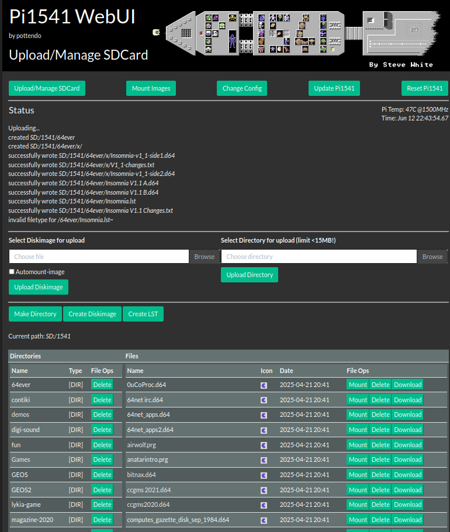
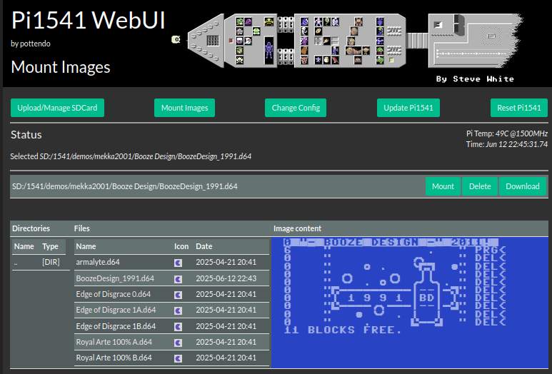
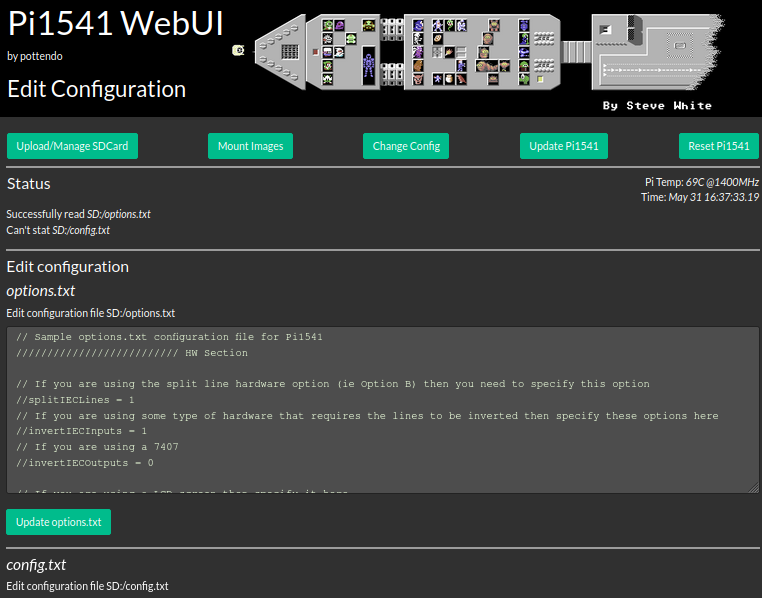
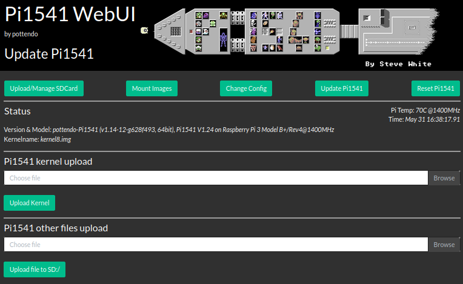

# Pi1541 - pottendo-Pi1541

This is an optional port of Pi1541 (V1.25F) to the current Circle bare metal library (as of November 2025, Step 50.0.1).

# News
V2.1Beta3:
- Support USB drives in WebUI, image files must be located under directory '/1541' on the USB drives/sticks.
- Support firmware update from USB (untested!)
V2.1Beta2:
- Support to rename of files/dirs on SDCard via WebUI
- Support to create/edit .txt, .nfo or .lst files
- Support creating empty d81 images
- IEC command fix for partition parsing, credits to RetroNynjah
- Bugfixes: navigate dirs with spaces in names over several levels, proper filename for PRG when mounted
- Minor changes: remove debuglogs
V2.1Beta1:
- LST support for D81 images 
  Limitation: Mix D81 with others in one .LST file won't work, see also 'bugs' below.
- Configure web-memory profile (see new options below)
- Improved rotary support - Credits to hgryska
- Minor fixes: 3A+ kernel name for upload, create image supports .g64, ...

Almost all Pi model specific bindings which have a counterparts in Circle have been removed. This allows to use the potential of Circle to extend Pi1541 with new functionalities. 
A web-server has been added which features the WebUI:
- Manage Upload and SDCard
  - upload of images and directory trees to the SDCard
  - delete of files & directories
  - download files
  - create directory
  - create new diskimages, use extension to select between .d64 or .g64 formats (.d81 is not supported)
  - create LST files from current directory
  - show icons (.png) if exists for images
  - script to upload files or directories via commandline
  - script to mount from an index via commandline, index can be generated
- Mount Images
  - mount images, LST files
  - image content preview, including D81 images
  - image preview
- Edit of _options.txt_ and _config.txt_
- Update Pi1541 files like _options.txt_, _config.txt_, _Pi1541 kernel_
- View & Download log-messages
- Reboot of Pi1541

Some further ideas:
- Make some options changeable via a WebGUI controls: e.g. drive number, etc.
- ...

Credits to Steve (@pi1541) [Pi1541](https://cbm-pi1541.firebaseapp.com/) and [Pi1541-github](https://github.com/pi1541/Pi1541), Rene (@rsta2) [circle](https://github.com/rsta2/circle), Stephan (@smuehlst) [circle-stdlib](https://github.com/smuehlst/circle-stdlib) for the brilliant base packages! Also some credit goes to @hpingel, [Network SK64](sk64), where I got the inspiration how to implement the webserver.

Some discussions, announcements one can find in the Forum64 thread, [here](https://www.forum64.de/index.php?thread/155126-new-release-pottendo-pi1541-webserver-for-upload-images-updates/&postID=2276999#post2276999).

# Installation

For your convencience a fully populated Pi1541 is prepared for easy setup. 
Copy the content of the release bundle to your boot partition of your Pi1541 SDCard. Make sure you adapt `options.txt` to your Pi1541 hardware setup (_Option A_ or _Option B_). Option B hardware is default. If you want to use networking (Wifi or Ethernet), see below how to activate.

# Status
------
The following is supposed to work on the circle based _V1.25c_, as I've tested those functions a bit:
- Pi1541 on Raspberry models 3A+ ***), 3B+, PiZero 2W, 4: successful load (JiffyDOS) of some games with fastloaders and GEOS
- Option A HW Support 
- Option B HW Support *)
- LCD Display SSD1306, SH1107 (128x128 pixel resolution) **)
- Rotary Input
- Buzzer sound output
- PWM/DMA Soundoutput (sounds nicer than in legacy codebase, IMHO)
- USB Keyboard and USB Massstorage (improved over original, see also Bugs below)
- Ethernet or WiFi network (if configured) starts and seeks for a DHCP server, a webserver runs, time is fetched via NTP if possible

*) Credits to @znarF who kindly donated and tested on Option B HW and @ILAH on F64, who tested Option B HW.

**) The display may have some pull-up resistors installed on its I2C data/clock lines (SDA/SCL lines). These won't work on I2C-1 of Raspberry PIs, as I2C-1 there already features 1.8kOhm pull-ups, which probably conflict with other pull-ups on this I2C-1 bus. Pi1541 HW hats often default to I2C-1. If your display isn't working, try to move it to I2C-0. Your Pi1541-hat may support this with solder bridges.

***) thans to @SvOlli on F64, who kindly donated a Pi3A+

<br />

If enabled (see below), network is activated in the background. For Wifi it may take a few seconds to connect and retreive the IP Address via DHCP. One can chose a static network configuration for faster startup, see below.
The IP address is briefly shown on the LCD, once received. One can check the IP address on the screen (HDMI).

<br />
The webserver controls the main emulation loop (e.g. uploads finished) by global variables. Access to the SDCard Filesystem is not synchronized or otherwise protected. If an (C64-) application writes to its disk, respectivley to the disk-image on Pi1541 and in parallel the webserver is used to upload the very same image, file-corruption or even file-system corruption may occur. The server and parallel emulation seems quite independent. I've tested a critical fastloader(Ghost'n'Goblins Arcade) and uploading in parallel successfully.

One can also use `curl` to script the upload - this may be usefull to be included in your build-process or bulk upload into `/1541` or other directories. 
For your convenience a shell-script `pi1541-util.sh` is provided to hide the complex commandline:
```
$ ./pi1541-util.sh -h
Usage: mount from index: ./pi1541-util.sh [-i <index-file>] [-pi http://my.pi.local.address ] search [num]
Defaults: -i 1541.txt -pi http://pi1541.lan
Usage: generate image from running Pi1541: ./pi1541-util.sh -g [-i <index-file> ]
writes a file 1541.txt in the current host directory, using filename specified by (-i)
Usage: upload files/directories: ./pi1541-util.sh [-pi http://my.pi1541.local.address ] [-d dest-dir] -u dir|file [dir|file ...]
uploads (-u) are pushed to /1541 or below if specified with (-d)
Use export PI1541=http://my.pi1541.local.address to avoid option [pi]

e.g. upload
$ ./pi1541-util.sh -d test-dir4 -u wonderland_xiv Xetris\ -\ Destiny.d64 
Using http://192.168.1.31...
uploading directory wonderland_xiv...
creating directory test-dir4/wonderland_xiv
uploading wonderland_xiv_s1.d64 to test-dir4/wonderland_xiv
uploading wonderland_xiv_s1.png to test-dir4/wonderland_xiv
uploading wonderland_xiv_s2.d64 to test-dir4/wonderland_xiv
uploading wonderland_xiv_s4.d64 to test-dir4/wonderland_xiv
uploading wonderland_xiv_s3.d64 to test-dir4/wonderland_xiv
uploading file Xetris - Destiny.d64 to test-dir4

e.g. mount
$ ./pi1541-util.sh -g armalyte
Using http://192.168.1.31...
generating index 1541.txt
searching for armalyte

Matching images:

1:/armalyte.d64
2:/demos/deus/armalyte.d64
3:/Games/armalyte.d64

Disk: 2

mounting /demos/deus/armalyte.d64
curl -s http://192.168.1.31/mount-imgs.html?%5BMOUNT%5D&2F%2Fdemos%2Fdeus%2Farmalyte.d64
```
_Note_: not all error cases of e.g. wrongly supplied paths could be handled, so curl may report success without the desired effect. Scripting in general (e.g. with other commands [DEL], etc.), may work but you can mess up your SDCard easily.


<br />

Note: checking the <i>Automount-image</i> checkbox, uploads and overrides the default automount image automatically inserts it in the caddy. This allows an efficient development workflow, IMHO.

When uploading directories, the browser may ask if you're sure. You still need to click the `Upload Directory` button to really upload!


<br />

Select image for preview and mount it.
<br />


<br />

A simple text-entry form based configuration editor is provided. Once uploaded potentially existing files on the SDCard are backuped by adding `.BAK` and then the content of the text-entry form is written to the file. Be careful, no sanity checks are made. Wrong configuration may stop Pi1541 from working after reboot.



Updates of Pi1541 kernel images require the correct filename, which must match the Pi model and the line `kernel=...` in `config.txt`. Once the filename is correct, files are overridden on the SDCard, no backup is made!
<br />

The codebase is the publically available Pi1541 code, V1.24 (as of Jan. 2024) + patched to 1.25 (as of July 2025) with some improvements:

- LED/Buzzer work again as in 1.23
- some bugfixes to avoid crash (missing initializer)
- build support for moden GCCs (-mno-unaligend-access)
- new option `headLess`, see below
- new options for static or DHCP network configuration, see below
- as a reset button is missing on most PIs, this is mapped to the button combo which selects DriveID 11 (a rare use-case for me)
- added support for a SH1107 based LCD featuring 128x128 pixel resolution (see note above on I2Cs and pull-up resistors in case it doesn't work)
- SoundOnGPIO = -1 turns sound completely off

Still the legacy code can be built with support for all supported hardware variants, include PiZero, Pi1 and Pi2 variants - see build chapter _Build_.
The floppy emulation is entirely untouched, so it's as good as it was/is in V1.25 - which is pretty good, IMHO! **Credits to Steve!**
As the original source builds are provided in `orig-build`, the version using circle appends 'c', e.g. when displayed on the LCD.
<br />

## Compatibility

The emulation is quite demanding for Pis (reaction time in <1us). Empirically I've found the following rules which may increase the compatibility:
- more MHz => better: a Pi4 clocked to 1800Mhz is probably the high-end; though not needed in 99.9% of the cases
  - see `config.txt` how to adapt or overclock in case you want that
  - Pi3s automatically regulate clock when reaching certain thresholds, see `temp_soft_limit` parameter in `config.txt` and `socmaxtemp` in `cmdline.txt`.
    It is recommended to use active cooling (small unaudible fans are sufficient) to get temperature down, especially when housings are used.
- HDMI output and output to the LCD may cause issues
  - use `DisableHDMI = 1` or `headLess = 1`
  - use `DisplayTemperature = 0`
- I found on Pi3s 32 bit version a bit more stable 
  - don't use 64bit builds, see `config.txt`
- I've seen that DMA sound delays emulation
  - `SoundOnGPIO = 1` for Buzzer or `SounOnGPIO = -1` for no sound at all
- Users have reported
  - IEC Cable length and quality may have an impact
  - Quality of LS and level shifter of the Pi1541 HW
  - General Pi1541 hat quality, related to power supply
- Finally, Steve's original source base may offer best compatibility as the web-server and all new functions are not entirely decoupled from the main emulation loop

## Misc
Other uController support has been added:
- Raspberry Pico 2W, ESP32 support. One needs a uController with sufficient RAM (e.g. PSRAM), see uC-1541

However, the code compiles and runs in principle on those platforms; due to the limits of those uControllers Pi1541 won't run. The code can be used as base for further more powerful uControllers providing sufficient memory and performance to handle Pi1541 hard realtime requirements.

**Attention**: the operating temperature is substantially higher than with the original kernel (legacy build). It is recommended to use _active_ cooling as of now. Raspeberry PIs normally protect themselves through throtteling. This should work latest at 85C - you may lower this threshold via `cmdline.txt` using e.g. `socmaxtemp=80`.

For Pi3B models there're further parameters set in `config.txt`: `temp_soft_limit=70` and `temp_limit=80`. PI3B+3A+'s protect themselves by down-clocking from 1400MHz to 1200MHz when reaching the `temp_soft_limit`. This may degrade compatibility for complex fast-loaders.

## TODOs

- You tell me!

## What will not come

- PiZero support for circle, as it doesn't make sense due to lack of network support
- Circle Support for all variants of Pi1 and Pi2, as I don't have those to test
- Pi5 support - with support from @rsta, I found that the GPIO performance of the Pi5 is significantly slower than on earlier models due to its changed hardware architecture. Even with some tweaking, Pi1541 misses cycles and emulation breaks. The code is prepared for Pi5, but as of now not working; maybe never will.
- Pico2/ESP32 support
  
# Additional Options in `options.txt`

The following options control new functions available:
| Option      | Value  | Purpose                                  |Default|Comment |
| ----------- | ------ | ---------------------------------------- |--------|--------|
| SoundOnGPIO | 0 or 1 or -1 | 0: DMA Sound, 1: GPIO Sound, -1: Sound off |0||
| TZ          | e.g. 2.0 | set the timezone relative to UTC, CEST = 2.0, NewYork/US = -5.0, Delhi/In = 5.5 |2.0||
| netEthernet | 0 or 1 | disable/enable Ethernet network          |0||
| netWifi     | 0 or 1 | disable/enable Wifi network              |0||
| maxContentSize | value | max memory in kB for webserver | 1000 | range from 256 to 4000 |
| maxMultipartSize | value | max memory in kB for multipart uploads | 20000| range from 1000 to 20000 |
| useDHCP     | 0 or 1 | disable/enable DHCP for optaining IP configuration |1||
| IPAddress   | a.b.c.d | IP Address, e.g. _192.168.1.31_          ||ignored when using DHCP |
| NetMask   | a.b.c.d | NetMask, e.g. _192.168.1.0_          ||ignored when using DHCP |
| DefaultGateway   | a.b.c.d | Gatway Address, e.g. _192.168.1.1_          ||ignored when using DHCP |
| DNSServer   | a.b.c.d | DNS Server, e.g. _192.168.1.1_          ||ignored when using DHCP |
| headLess    | 0 or 1 | obsolete, same as DisableHDMI: disable/enable HDMI output |0||

Here a snippet one can add to his `options.txt`:
```
// this turns on/off HDMI output
headLess = 1  // no HDMI output

// Network configuration, WiFi needs a proper wpa_supplicant.conf configured for you SSID
TZ = 2.0    // Timezone: 2.0=CEST is default, use -5.0 for ET (e.g. New York/US), use 5.5 for New Delhi/IN
netWifi = 0
netEthernet = 1
// webserver static memory profile in kB, use smaller value (4000) for Pis < 1GB memory.
maxContentSize = 1000     // == 1MB (min 256, max 4000)
maxMultipartSize = 20000  // == 20MB for directory upload (min 1000, max 20000)

// Static network config, to avoid slow DHCP - not much sanity is done, so write properly
useDHCP = 1 // get network config automatically, else set to '0' and define static network config below
//IPAdress = 192.168.1.31
//NetMask = 192.168.1.0
//DefaultGateway = 192.168.1.1
//DNSServer = 192.168.1.1
```
# Know Bugs

- Plugging/Unplugging USB stick is in general not recommended and unstable.
- Up to 3 USB drives show up, should be possible to have 4, but it didn't work in my setup: error FR_NOT_READY (3)
- D81 LST mounted set. Changing images works; but if one just loads '$' then always the directory of the first image is loaded from the host.

# Checkout & Build

The following compiler suites were used for development:

| Compiler | Package name                                     | Link                                                                                                                                          | Arch               |
| -------- | ------------------------------------------------ | --------------------------------------------------------------------------------------------------------------------------------------------- | ------------------ |
| GCC      | AArch32 bare-metal target (arm-none-eabi)        | [download](https://developer.arm.com/-/media/Files/downloads/gnu/14.3.rel1/binrel/arm-gnu-toolchain-14.3.rel1-x86_64-arm-none-eabi.tar.xz)    | 32 bit             |
| GCC      | AArch64 ELF bare-metal target (aarch64-none-elf) | [download](https://developer.arm.com/-/media/Files/downloads/gnu/14.3.rel1/binrel/arm-gnu-toolchain-14.3.rel1-x86_64-aarch64-none-elf.tar.xz) | 64 bit |

Make sure your `PATH` variable is set appropriately to find the installed compiler suite.

For building the project needs certain developer tools installed. Depending on your Linux installation these may be needed to be installed:
_make, wget, unzip, git, sed, patch, c1541_.

My development machine is an x86_64 based ArchLinux box.
Checkout & build
```
BUILDDIR=build-pottendo-Pi1541
mkdir $BUILDDIR
cd ${BUILDDIR}
git clone https://github.com/pottendo/pottendo-Pi1541.git

# now checkout circle-stdlib and populate a Pi1541 root
cd ${BUILDDIR}/pottendo-Pi1541
./build.sh -c   # this clones circle-stdlib in ${BUILDDIR} and populates a Pi-bootpartition here: ${BUILDDIR}/Pi-Bootpart
# if all goes well, you're ready to build
./build.sh      # kernels for Pi3/32bit Pi3/64bit Pi4/32bit Pi4/64bit are built and finally moved to ${BUILDDIR}/Pi-Bootpart
# to build for a single architecture, one can use e.g. 'build.sh -a pi3-32' 
# subsequently you can build just using 'make' this uses circle-stdlib as used with the previous 'build.sh' run

```
Depending on the RPi Model and on the chosen build (Circle vs. legacy):
| Model                 | Version      | build cmd                                         | Image Name                                         | Note                                  |
| --------------------- | ------------ | ------------------------------------------------- | -------------------------------------------------- | ------------------------------------- |
| Pi Zero, 1RevXX, 2, 3 | legacy build | `make RASPPI={0,1BRev1,1BRev2,1BPlus,2,3} legacy` | `kernel.img` or script built: `kernel-Pi0.img` `kernel-Pi1BPlus.img`  `kernel-Pi1BRev1.img`  `kernel-Pi1BRev2.img`  `kernel-Pi2.img`  `kernel-Pi3.img` in ${BUILDDIR}/Pi-Bootpart |  `     kernel_address=0x1f00000` needed in config.txt                                |
| 3                     | circle build | `make`                                            | `kernel8-32.img` (32bit), `kernel8.img`(64bit)                                   |                                       |
| Pi Zero 2W            | circle build | `make`                                            | `kernel8-32.img` (32bit), `kernel8.img`(64bit)                                      | PWM Sound not upported                |
| Pi 4                  | circle build | `make`                                            | `kernel7l.img` (32bit), `kernel8-rpi4.img` (64bit) |                                       |
| Pi 5                  | circle build | `make`                                            | `kernel_2712.img`                                  | broken, PWM Sound not (yet) supported |

*Hint*: in case you want to alternatively build for circle-lib and legacy make sure to `make clean` between the builds!

Finally copy the kernel image(s) to your Pi1541 SDCard boot partition.
The prepared _config.txt_ covers several Pi models, and defaults to 64bit versions. If you want to boot the 32 bit versions, adjust `config.txt` accordingly - see comments below.
In case you want to run the slightly improved legacy 1.25 version (_kernel.img_) you may reuse the [pi0] section at the top for a Pi Zero.

Here the sample `config.txt` on your Pi1541 SDcard, ready to be used for pottendo-Pi1541:

```
# PiZero model
[pi0]
# force_turbo = 1 in combination with over_voltage invalidates warranty!
# may improve compatibility, and needed for Steve's original kernels
force_turbo=1
arm_freq=1100
over_voltage=6
sdram_freq=450
sdram_over_voltage=2
boot_delay=1
arm_64bit=0
gpu_mem=0
#kernel_address=0x1f00000   # uncomment on PiZero, otherwise its used also for PiZero2W of 32bit boots... and fails
kernel=kernel-Pi0.img

# this is for the PiZero 2W, merged with [p0]!
[pi02]
arm_freq=1400
over_voltage=4
sdram_freq=450
sdram_over_voltage=1
boot_delay=1
gpu_mem=0
hdmi_group=2
hdmi_mode=16
# select 32- or 64-bit mode
arm_64bit=0
# Pi 3 & Pi Zero 2W, 32bit
kernel=kernel8-32.img
# Pi 3 & Pi Zero 2W, 64bit
#kernel=kernel8.img

# P1 models
[pi1]
# force_turbo = 1 in combination with over_voltage invalidates warranty!
# may improve compatibility, and needed for Steve's original kernels
force_turbo=1
arm_freq=1100
over_voltage=6
sdram_freq=450
sdram_over_voltage=2
boot_delay=1
arm_64bit=0
gpu_mem=0
kernel_address=0x1f00000
kernel=kernel-P1BPlus.img
#kernel=kernel-P1BRev1.img
#kernel=kernel-P1BRev2.img

[pi2] 
# untested
#arm_freq=1100
#sdram_freq=500
#over_voltage=6
#kernel_address=0x1f00000
#kernel=kernel-Pi2.img

# all Pi3 variants
[pi3]
# force_turbo = 1 in combination with over_voltage invalidates warranty!
# may improve compatibility, and needed for Steve's original kernels
force_turbo=1
arm_freq=1400
over_voltage=4
sdram_freq=500
sdram_over_voltage=1
temp_soft_limit=70
temp_limit=80
boot_delay=1
gpu_mem=0
hdmi_group=2
hdmi_mode=16
# select 32- or 64-bit mode
arm_64bit=0
# Pi 3 & Pi Zero 2W, 32bit
kernel=kernel8-32.img
# Pi 3 & Pi Zero 2W, 64bit
#kernel=kernel8.img
# Pi3 legacy 32bit kernel
#kernel_address=0x1f00000
#kernel=kernel.img

# all Pi4 variants
[pi4]
hdmi_force_hotplug=1   # Force HDMI output even if no monitor detected
hdmi_group=2           # Set display mode to DMT (monitor)
hdmi_mode=82           # Set resolution to 1920x1080 @ 60Hz
max_framebuffers=2
# select 32- or 64-bit mode
arm_64bit=0
# Pi 4, 32bit
kernel=kernel7l.img
# Pi 4, 64bit
#kernel=kernel8-rpi4.img

[all]
#enable_uart=1
# Disable compensation for displays with overscan
disable_overscan=1
```

Uart console on pins *14(TX)/15(RX)* gives useful log information. A sample _cmdline.txt_ with `console=serial0,115200 logdev=ttyS1 socmaxtemp=80 loglevel=2` is provided. If you have other options, put all options in one line, put _loglevel=4_ if you want to see the full developer debug log.

## Pi Bootfiles

All necessary files for Pi Zero/2, Pi3 and Pi4 and their variants are provided on the sample bootpartition.

## Networking

If enabled, WiFi needs the drivers on the flash card. All necessary files are provided on the sample bootpartition.

However you need edit the file 
  `wpa_supplicant.conf`
on the toplevel to configure your SSID:
```
#
# wpa_supplicant.conf
#
# adjust your country code
country=AT

network={
    # adjust your SSID
    ssid="REPLACE_WITH_MY_NETWORK_SSI"
    # adjust your WiFi password
    psk="REPLACYE_WITH_MY_WIFI_PASSWORD"
    proto=WPA2
    key_mgmt=WPA-PSK
}
```
## Building the original version

One can build the Version 1.24 (+some minor fixes: LED & Buzzer work, build/works with gcc > 10.x).

```
# for Legacy build:
# use RASPPI = 1BRev1 for Raspberry Pi 1B Rev 1 (26 IOports) (GPIO0/1/21)
# use RASPPI = 1BRev2 for Raspberry Pi 1B Rev 2 (26 IOports) (GPIO2/3/27)
# use RASPPI = 1BPlus for Raspberry Pi 1B+ (40 I/OPorts)
# use RASPPI = 0 for Raspberry Pi Zero
# use RASPPI = 3 for Raspberry Pi Zero 2W or Raspberry Pi 3
# use V = 1 optionally for verbose build
# e.g.
# 	make RASPPI=1BPlus V=1 legacy
#
# if you switch from legacy build to circle build 'make clean' is mandatory
```

Copy the resulting `kernel.img` to your SDCard and adjust the appropriate section (e.g. _[pi3]_) to load this image by uncommenting the lines
```
kernel_address=0x1f00000
kernel=kernel.img
```
For other Pi models, you may need to add appropriate sections and the needed options to your _config.txt_.

## Internals

I needed to patch a few compile-time parameters and code workarounds in circle - see src/Circle/patch-XXX.diff:
- Kernel parameters for memory and tasks
- FatFS subsystem parameters
- Workarounds in wpa_supplicant (mesh network support) and USB (don't assert, on cheap USB sticks)

# Disclaimer

**Due to some unlikely, unexpected circumstances (e.g. overheating), you may damage your beloved devices (Raspberry Pi, Retro machines, Floppy Drives, C64s, VIC20s, C128s, SDCards, USBSticks, etc) by using this software. I do not take any responsibility, so use at your own risk!**

Circle based Pi1541 is distributed in the hope that it will be useful,
WITHOUT ANY WARRANTY; without even the implied warranty of
MERCHANTABILITY or FITNESS FOR A PARTICULAR PURPOSE. See the
GNU General Public License for more details.
 
You should have received a copy of the GNU General Public License along with Pi1541. If not, see <http://www.gnu.org/licenses/>.

# Pi1541

Commodore 1541/1581 emulator for the Raspberry Pi

Pi1541 is a real-time, cycle exact, Commodore 1541 disk drive emulator that can run on a Raspberry Pi 3A, 3B or 3B+. The software is free and I have endeavored to make the hardware as simple and inexpensive as possible.

Pi1541 provides you with an SD card solution for using D64, G64, NIB and NBZ Commodore disk images on real Commodore 8 bit computers such as;-
Commodore 64
Commodore 128
Commodore Vic20
Commodore 16
Commodore Plus4

See https://cbm-pi1541.firebaseapp.com/ for SD card and hardware configurations.

In order to build the Commodore programs from the `CBM-FileBrowser_v1.6/sources/` directory, you'll need to install the ACME cross assembler, which is available at https://github.com/meonwax/acme/
